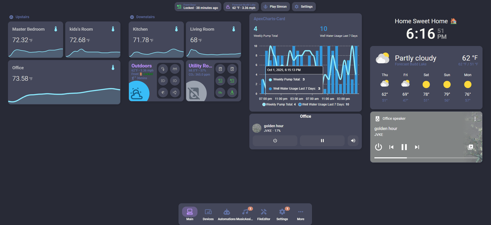
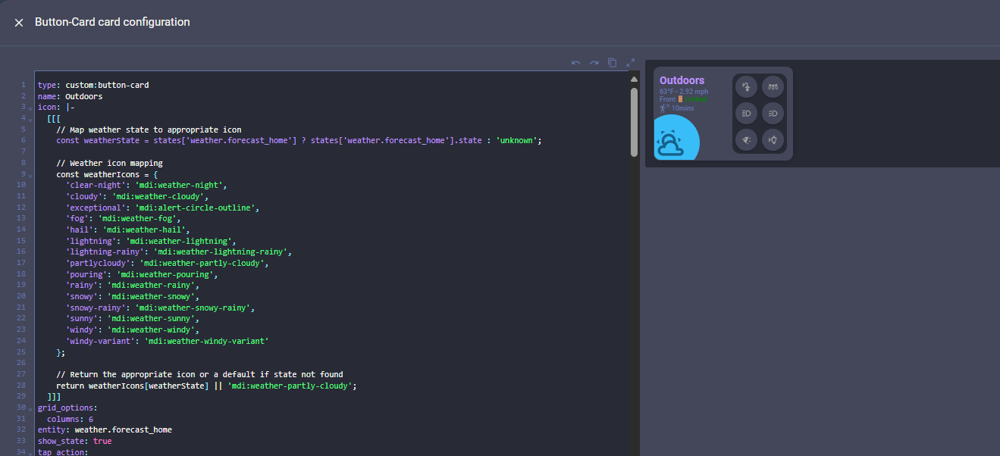

# Dracula for [Home Assistant](https://www.home-assistant.io)

> A dark theme for [Home Assistant](https://www.home-assistant.io).

### Code Editor View

## Install

All instructions can be found at [draculatheme.com/home-assistant](https://draculatheme.com/home-assistant).

## Features

- ✨ Authentic [Dracula color palette](https://draculatheme.com/contribute)
- 🎨 Complete theme coverage (cards, sidebar, dialogs, inputs, dropdowns)
- 🎮 Enhanced media player controls (Music Assistant support, progress bars, album art)
- 🔄 Comprehensive state colors for all entity types
- 📊 Energy dashboard support
- 📈 Multi-color history graphs and logbook styling
- 🗺️ Map card support with custom zone colors
- 🎯 Modern 12px border radius on cards
- ✨ Smooth transitions and hover effects for premium feel
- 🌙 Dark mode optimized with enhanced depth perception

## Acknowledgments

This theme was created following official [Home Assistant theme guidelines](https://www.home-assistant.io/integrations/frontend/) and inspired by the excellent work of the Home Assistant theme community.

## Team

This theme is maintained by the following person(s) and a bunch of [awesome contributors](https://github.com/dracula/home-assistant/graphs/contributors).

|  |
| -------------------------------------------------------------------------------------------------------------- |
| [Mantej Singh](https://github.com/Mantej-Singh)                                                                |

## Community

- [Twitter](https://twitter.com/draculatheme) - Updates about Dracula themes
- [GitHub Discussions](https://github.com/dracula/dracula-theme/discussions) - Questions and discussions
- [Discord](https://draculatheme.com/discord-invite) - Chat with the community
- [Home Assistant Community](https://community.home-assistant.io/) - HA-specific help

## Dracula PRO

## License

[MIT License](./LICENSE)
